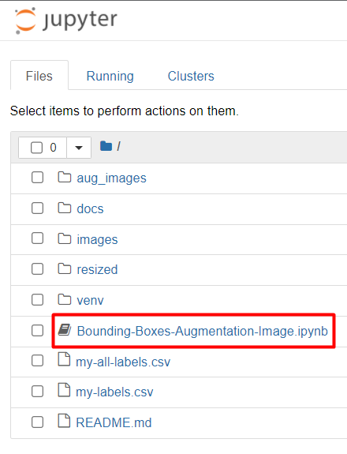
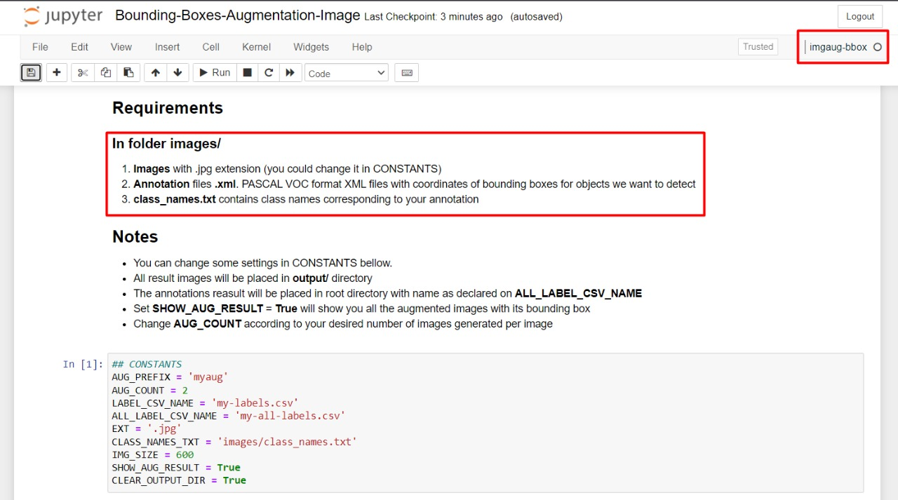

# imgaug-bbox
Image augmentation for machine learning experiments.
Based on [aleju/imgaug](https://github.com/aleju/imgaug) and implemetation of [asetkn](https://github.com/asetkn/Tutorial-Image-and-Multiple-Bounding-Boxes-Augmentation-for-Deep-Learning-in-4-Steps).

# Install
- Clone **imgaug-bbox**
  ```bash
  git clone https://github.com/fajarbc/imgaug-bbox
  cd imgaug-bbox
  ```
- Setup virtual environtement & Kernel
  ```bash
  python -m venv venv
  .\venv\Scripts\activate
  pip install ipykernel
  python -m ipykernel install --user --name=imgaug-bbox
  ```
- Install **imaug**
  ```bash
  pip install git+https://github.com/aleju/imgaug.git
  pip install imagecorruptions pandas
  ```
  For more details, see the [install guide](https://imgaug.readthedocs.io/en/latest/source/installation.html).

# Running
- Before running, always make sure you are in venv environtment
  ```bash
  .\venv\Scripts\activate
  ```
  You should view something like ```(venv) C:\``` in your terminal.
- Run Jupyter Notebook
  ```sh
  jupyter notebook
  ```
- Open **`Bounding-Boxes-Augmentation-Image.ipynb`** file
 
 - Meet its requirements, make sure your kernel is **imgaug-bbox** and just run all the cells
 
   